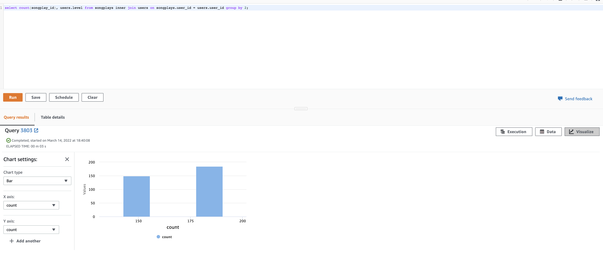
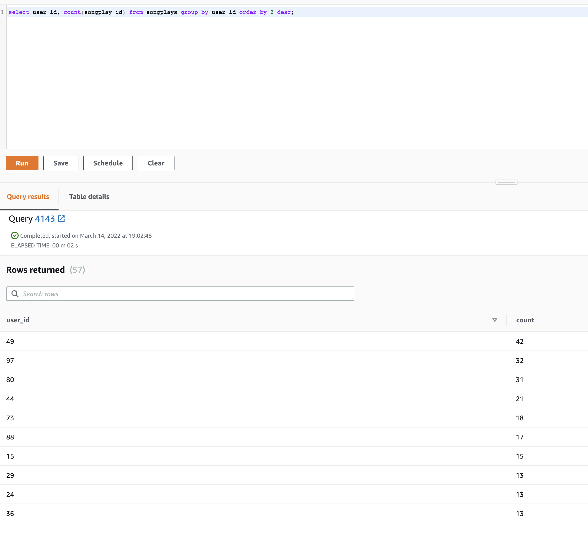

# Project3 Data Warehouse
This the third project for the udacity nanodegree. This ETL project looks to collect and present user activity information for
the music streaming app called Sparkify. This is all done in AWS using S3 storage as the source of the log files from the app and loading them into 
AWS Redshift database.


## Setting Up

1.You need to have an AWS account. Otherwise create one.
2. Create an IAM user with "Programmatic
access" as the access type and attach the "AdministratorAccess" as the policy for the user
policy for the user
3. Once you have reviewed and created the user copy the **Access key ID** and **Secret access key**.
4. Copy template_dwh.cfg to create dwh.cfg
5. Update **KEY** and **SECRET** with the values for Access Key ID and Secret access key from above respectively.

### Set up Python environment and AWS infrastructure
This will work on an environment running Python 3.9.x

1. Create a virtual environment
```
python -m venv .venv
```
2. Activate virtual environment and install dependencies
```
source .venv/bin/activate
pip install -r requirements.txt
```
3. Update the config file **dwh.cfg** cluster section with the specs for the Redshift cluster you want
4. Also update the dwh section in the file **dwh.cfg**  with the database credential except for the host
5. You can specify the S3 file locations in the S3 section also.
6. To create the infrastructure you can run below python code
```
python infra.py
```
This will run for some time and you will see various message on the terminal telling you
on which step of the process it is on. Please wait until you see the message
```
Your Redshift Cluster is now created
```
7. Copy the value of the DWH_ENDPOINT that is part of the output and update the host field in the **dwh.cfg** file. 
The arn field in the IAM_ROLE section should be automatically update double check that too.
   
8. In the event you have an issue with anything. You can run below script which will delete your cluster.
```
python delete_infra.py
```

## Running the ETL
1. Create the tables
```
python create_tables.py
```
2. Load the staging tables and reporting tables
```
python etl.py
```

## Database and Schema


The database has a staging/landing area. Here the data is copied from the S3 bucket to the redshift database
```
CREATE TABLE IF NOT EXISTS staging_events (
artist text,
auth text,
first_name text,
gender char(1),
item_session numeric,
last_name text,
length numeric,
level text,
location text,
method text,
page text distkey,
registration numeric,
session_id numeric,
song text,
status numeric,
ts timestamp sortkey,
user_agent text,
user_id numeric
)

CREATE  TABLE IF NOT EXISTS staging_songs (
num_songs numeric,
artist_id text distkey,
artist_latitude numeric,
artist_longitude numeric,
artist_location text,
artist_name text,
song_id text,
title text,
duration numeric,
year numeric
)
```

The staged data is then inserted into dimension tables namely, **we make use of primary keys here to ensure no duplicates** :

```
CREATE TABLE users (
user_id int distkey sortkey not null,
first_name text,
last_name text,
gender text,
level text,
PRIMARY KEY (user_id))

CREATE TABLE songs (
song_id text distkey sortkey not null,
title text,
artist_id text,
year int,
duration double precision,
PRIMARY KEY (song_id))

CREATE TABLE artists (
artist_id text distkey sortkey not null,
name text,
location text,
latitude double precision,
longitude double precision,
PRIMARY KEY (artist_id))

CREATE TABLE time (
start_time timestamp distkey sortkey not null,
hour int,
day int,
week int,
month int,
year int,
weekday int,
PRIMARY KEY (start_time))
```

Using the dimension tables, the staged data we load the data into final reporting table. **Primary key and also referential 
integrity** is used to ensure no duplicates. The table also has a **sort key and distribution key** for optimisation when 
querying the data.

```
CREATE TABLE songplays (
songplay_id bigint IDENTITY(0, 1),
start_time timestamp references time(start_time) sortkey not null,
user_id int references users(user_id) distkey not null,
level text,
song_id text references songs(song_id),
artist_id text references artists(artist_id),
session_id int,
location text,
user_agent text,
PRIMARY KEY (songplay_id))
```

## Sample queries and analysis

You can access the Redshift cluster via AWS console and go to the [Query editor to run queries](https://docs.aws.amazon.com/redshift/latest/mgmt/query-editor.html).
In the below sample queries I have used the v1 query editor.

1. query to find if paid or free users have the most songplays
```
select count(songplay_id), users.level from songplays inner join users on songplays.user_id = users.user_id group by 2;
```
 "Query 1 Analysis"

2. Query to find which user has the most songplays
```
select user_id, count(songplay_id) from songplays group by user_id order by 2 desc;
```
"Query 2 Analysis"


### Files in Project

1. ```create_tables.py``` : this file is responsible for dropping and recreating the tables needed in the Redshift cluster.
2. ```delete_infra.py``` : this file stops and deletes all the redshift cluster infrastructure.
3. ```etl.py``` : this file has the code that loads the data from S3 -> staging-> dimension tables -> reporting table.
4. ```infra.py```: this has the code to create all the needed infra as specified in the .cfg file.
5. ```sql_queries.py```: all the SQL code is found in here including creating and dropping of tables.
6. ```template_dwh.cfg```: this is the template guide on how to make your own cfg file.
